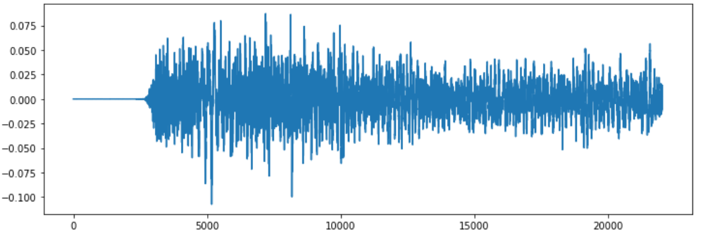
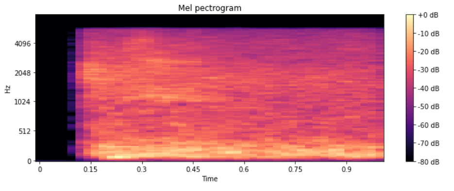

# Speaker Recognition

# Problem Statement and Methodology  

In the **Speaker Recognition problem**, we are provided with a dataset comprising speeches of prominent personalities in the form of .wav files. Besides, a background noise audio file has also been given, which can be intertwined with the speech audios to ensure better results. Here, our objective is to train a model with the best possible accuracy that can correctly predict the speaker of the speech; thus, it is an Audio Classification problem.

We will deal with the problem statement in the following stepwise manner:

•	**Data Exploration and Visualization:** As should be done with any Machine Learning/Data Science problem, we begin with understanding the data. Since we are given the data in directories in the form of wav audio file - we'll traverse through the directory and plot a few audio signals to understand the nature of the data provided.

•	**Data Pre-Processing:** After having explored the data, we'll pre-process the audio files. One of the most common ways to deal with audio data is to convert it into some kind of wave plot - thereby converting the audio processing problem into an image processing problem. Furthermore, we'll also store the wav file paths from the directories to local variables and then divide the data into training and testing datasets so that they can be employed for model training and evaluation.

•	**Model Building:** After having pre-processed the data, the next step will be to build a model. Since we are endeavouring to convert the audio files into graphical representations, we'll need to create a Convolutional Neural Network for this purpose. Thus, we will feed the model with waveplots, apply the convolution operation to the generated graphs, and perform the speaker recognition task.

•	**Model Evaluation:** Once the model is built on the training data set with an acceptable level of training accuracy, the model will be evaluated on the testing data, and the final accuracy will be determined.

# Data Exploration and Visualization: Wave Plots and Spectrographs
Upon traversal through various directories, the following personalities' voices were found in the dataset:
•	Nelson_Mandela (1500 Audio Samples)
•	Benjamin_Netanyau (1500 Audio Samples)
•	Magaret_Tarcher (1500 Audio Samples)
•	Jens_Stoltenberg (1500 Audio Samples)
•	Julia_Gillard (1501 Audio Samples)

To better understand the audio dynamics, we have plotted the following two graphical representations of the first training example of Benjamin_Netanyau's speech.

**Waveplot of Wav-0:**

**Mel Spectrograph of Wav-0:**

# Feature Extraction: Mel Spectrograms
Established as a matter of fact, audio files are rarely ever used directly for training deep learning models, we need to extract some features from the audio files in order to train our model. For this problem statement we’ll plot the audio signals and then train a CNN model using it. Now we have a platter of options when it comes to graphically representing our audio signals. 

Researcher have shown that Mel Spectrogram is a type of plot that plots spectrograms by employing Mel scale - which takes into consideration the dynamics of human speech and the range at which humans are accustomed to hearing. Since we are dealing with human speeches, we are using Mel spectrograms to train our CNN model.

# Model Building

As stated, we will be using a Convolutional Neural Network. The features of the CNN trained are enlisted below:

-	No. of Convolutional Layers: 1
-	Activation Function for convolutional/hidden layers: ReLU
-	Activation Function for output layer: Softmax
-	Optimizer: Adam
-	Learning Rate: 3e-4
-	Loss Function: sparse_categorical_crossentropy
-	Evaluation Metric: accuracy

# Model Evaluation
Upon evaluating on the testing data, following was obtained:
-	Training Accuracy: 97.03%
-	Testing Accuracy: 93.20% 

# Conclusion
We have successfully fetched the audio files from the directories, pre-processed them to form Mel Spectrograph - hereafter the problem turned into an image processing problem. Since CNNs are one of the best tools to deal with training of image models, we trained a CNN and accomplished decent accuracy levels.

